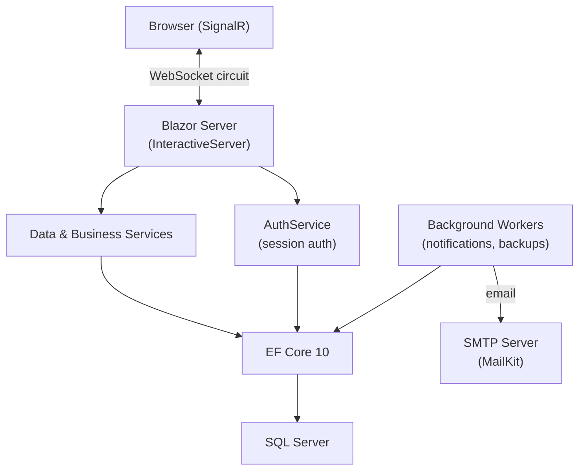
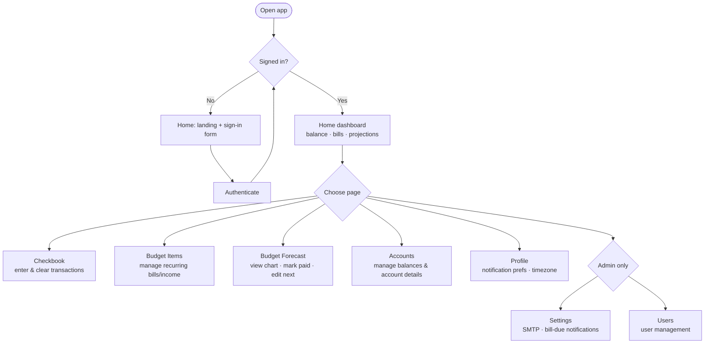

# SproutPenny Budget App

A personal budget and checkbook management application. Keeps a running transaction ledger, tracks recurring bills and income, forecasts your balance over time, and sends bill-due email reminders.

- **User Guide** → [docs/README.md](docs/README.md) (page-by-page walkthrough)
- **Backups** → [docs/backups.md](docs/backups.md) (backup/restore commands)

---

## Technical overview



The app is a **Blazor Server** application — all rendering and logic runs on the server. The browser holds only a lightweight WebSocket circuit. There is no client-side WASM layer, and only a small authenticated JSON endpoint for home dashboard summary integrations.

---

## Architecture

| Layer | Description |
|---|---|
| **Components/Pages/** | Routable Blazor pages. Each page has a `.razor` markup file and a `.razor.cs` code-behind partial class. |
| **Components/Layout/** | `MainLayout` — navigation bar, startup diagnostics banner. |
| **Services/** | Scoped and singleton services for data access, auth, email, and background work. Injected via constructor or `@inject`. |
| **Data/** | EF Core `DbContext`. All database access goes through here. |
| **Models/Entities/** | EF Core entity classes mapped to `cf`-prefixed SQL tables. |
| **Models/ViewModels/** | UI-facing projection types returned by data services. |
| **Migrations/** | EF Core SQL Server migrations. Applied automatically on startup. |

---

## User workflows



**Typical daily use:**
1. Open Home to check today's balance and upcoming bills
2. Open Checkbook to record any new transactions and clear settled ones
3. Optionally open Budget Forecast to see the shape of the next few weeks

**First-time setup:**
1. Accounts → create your accounts
2. Budget Items → add recurring bills and income
3. Checkbook → enter your opening balance transaction
4. Settings (admin) → configure SMTP if you want bill-due email reminders
5. Profile → opt in to notifications and set your timezone

---

## API surface

The app includes one authenticated JSON endpoint for home dashboard snapshot integrations.

### `POST /api/home-dashboard-summary`

Authenticates with an existing username/password, then returns the same core summary values used on the Home page.

Request JSON:

```json
{
  "username": "your-username",
  "password": "your-password"
}
```

Response codes:

- `200 OK` for valid credentials
- `401 Unauthorized` for invalid credentials

Response JSON (`200 OK`):

```json
{
  "asOfDate": "2026-04-24T00:00:00",
  "todayBalance": 1234.56,
  "upcomingBillsTotal": 450.00,
  "safeToSpend": 980.12,
  "safeToSpendDate": "2026-05-03T00:00:00",
  "upcomingBills": [
    {
      "budgetId": 42,
      "name": "Electric",
      "payee": "Power Co",
      "dueDate": "2026-04-28T00:00:00",
      "amount": 125.00,
      "isPastDue": false
    }
  ],
  "categorySpend": [
    {
      "categoryName": "Groceries",
      "total": 320.50,
      "budgetedMonthly": 400.00,
      "isOnBudget": true
    }
  ]
}
```

For full endpoint details, see [docs/api/home-dashboard-summary.md](docs/api/home-dashboard-summary.md).

---

## Technology

| Technology | Version | Purpose |
|---|---|---|
| .NET / ASP.NET Core | 10.0 | Runtime, DI, middleware, hosting |
| Blazor Server | 10.0 | UI framework — interactive server rendering via SignalR |
| Entity Framework Core | 10.0.3 | ORM; migrations applied automatically on startup |
| Microsoft.Data.SqlClient | 6.1.4 | SQL Server driver |
| Radzen.Blazor | 9.0.6 | UI component library (forms, dialogs, grids) |
| MailKit | 4.15.1 | SMTP email dispatch |
| Bootstrap | 5.3.3 | Layout and utility CSS (CDN) |
| Font Awesome | 6.5.1 | Icons (CDN) |
| Chart.js | 4.4.1 | Budget forecast line chart (CDN) |
| Moment.js | 2.30.1 | Date formatting in Chart.js (CDN) |
| DataTables | — | Checkbook transaction grid with search/sort (CDN) |
| jQuery | 3.7.1 | Required by DataTables (CDN) |

---

## File inventory

| Path | Description |
|---|---|
| `Program.cs` | App startup, DI registration, CLI commands (`backup`, `restore-smoketest`), startup diagnostics and migration runner |
| `ClintonFrankland.Blazor.csproj` | Version (`major.minor.patch.build`), NuGet references |
| `appsettings.json` | Connection string, `AppSettings`, `AuthSecurity`, logging config |
| `appsettings.Development.json` | Dev credentials and overrides (not committed to production) |
| `Dockerfile` | Multi-stage Docker build |
| `GLOBALIZATION.md` | Explains why culture is pinned to en-US |
| `Components/App.razor` | HTML shell — loads CDN assets (Bootstrap, FA, Chart.js, DataTables) |
| `Components/_Imports.razor` | Global `@using` and `@inject` for all components |
| `Components/Routes.razor` | Router wired to `MainLayout` |
| `Components/Layout/MainLayout.razor(.cs)` | Navbar, layout shell, startup diagnostics banner |
| `Components/Pages/Home.razor(.cs)` | Dashboard (snapshot cards, category spending) / landing + sign-in for guests |
| `Components/Pages/Login.razor(.cs)` | Dedicated sign-in page |
| `Components/Pages/Checkbook.razor(.cs)` | Transaction ledger with running balance and budget panel |
| `Components/Pages/Budget.razor(.cs)` | Budget forecast chart and upcoming items list |
| `Components/Pages/BudgetItems.razor(.cs)` | CRUD for recurring budget items |
| `Components/Pages/Accounts.razor(.cs)` | Account list with balances and details |
| `Components/Pages/Profile.razor(.cs)` | User preferences and notification settings |
| `Components/Pages/Settings.razor(.cs)` | Admin: SMTP config, bill-due notification settings, backup |
| `Components/Pages/Users.razor(.cs)` | Admin: user management |
| `Data/ClintonFranklandDbContext.cs` | EF Core `DbContext` — all `DbSet<T>` properties |
| `Models/Entities/` | EF Core entity classes (one per table) |
| `Models/ViewModels/` | UI projection types returned by data services |
| `Services/AuthService.cs` | Login, logout, lockout (5 attempts / 15-min window), session storage, audit logging |
| `Services/SiteInfoService.cs` | Reads `AppSettings` config block (site name, base URL, icon) |
| `Services/EmailSenderService.cs` | SMTP dispatch via MailKit |
| `Services/BillDueNotificationWorker.cs` | Hosted service — 15-min tick, sends bill-due emails per user timezone |
| `Services/AccountsDataService.cs` | Account CRUD and balance queries |
| `Services/CheckbookDataService.cs` | Transaction queries, payee/category lookups, monthly analytics |
| `Services/BudgetDataService.cs` | Budget CRUD and forecast projection logic |
| `Services/BudgetItemsDataService.cs` | Budget item management |
| `Services/DashboardDataService.cs` | Home snapshot: balance, upcoming bills, lowest projected balance, category spend |
| `Services/DatabaseBackupService.cs` | `BACKUP DATABASE … WITH COPY_ONLY, COMPRESSION` via ADO.NET |
| `Services/DatabaseBackupWorker.cs` | Hosted service — scheduled automated SQL backups |
| `Services/PasswordUtility.cs` | Salt generation and password hashing/verification |
| `Services/CurrencyPolicy.cs` | Decimal rounding helpers for currency values |
| `Services/StartupDiagnosticsState.cs` | Holds DB connectivity and pending-migration results for the admin banner |
| `Migrations/` | EF Core SQL Server migrations; applied automatically on startup |
| `wwwroot/css/app.css` | Global CSS overrides |
| `wwwroot/images/` | `sproutpenny.png`, `favicon.png` |
| `docs/` | Per-page user guides and test plans |

---

## SQL objects

All tables use the `cf` prefix.

| Table | Description |
|---|---|
| `cfUsers` | App users. Manually-assigned IDs, salt+hash passwords, `IsAdmin` flag, notification preferences (opt-in, timezone, delivery time). |
| `cfAccounts` | Financial accounts (checking, credit card, etc.). Tracks balance, cleared balance, credit limit, min payment, interest rate, due day. |
| `cfTransactions` | Ledger entries. Date, amount, payee, category, account, cleared flag, optional notes and attachment path. |
| `cfBudgets` | Recurring income/expense items. Frequency, next due date, end date, `IsBill`, `IsAutomatic`, `IsLate`, optional payee. |
| `cfCategories` | User-owned transaction and budget categories. |
| `cfPayees` | User-owned payees referenced by transactions and budget items. |
| `cfFrequencies` | Lookup: Weekly, Bi-weekly, Monthly, etc. |
| `cfAccountTypes` | Lookup: Checking, Savings, Credit Card, etc. |
| `cfAuthLoginAudit` | Login audit trail — username, IP, success/failure, reason, timestamp. |
| `cfSmtpSettings` | SMTP server configuration — host, port, TLS mode, sender identity, per-server credentials. |
| `cfBillDueNotificationSettings` | Server-wide gate for bill-due email notifications (enabled flag, due-soon window, past-due settings). |
| `cfNotificationSendLog` | Audit trail of sent notifications — user, budget, notice type, local date, status, error message. Prevents duplicate sends. |

---

## External dependencies

| Name | Version | Purpose |
|---|---|---|
| MailKit | 4.15.1 | SMTP email |
| Microsoft.Data.SqlClient | 6.1.4 | SQL Server wire protocol |
| Microsoft.EntityFrameworkCore.SqlServer | 10.0.3 | EF Core SQL Server provider |
| Microsoft.EntityFrameworkCore.Design | 10.0.3 | `dotnet ef` tooling support |
| Radzen.Blazor | 9.0.6 | Blazor UI component library |
| Bootstrap | 5.3.3 | CSS layout framework (CDN) |
| Font Awesome | 6.5.1 | Icon library (CDN) |
| Chart.js | 4.4.1 | Canvas charting (CDN) |
| Moment.js | 2.30.1 | Date labels for Chart.js (CDN) |
| DataTables | — | Table search/sort/pagination (CDN) |
| jQuery | 3.7.1 | DataTables dependency (CDN) |
