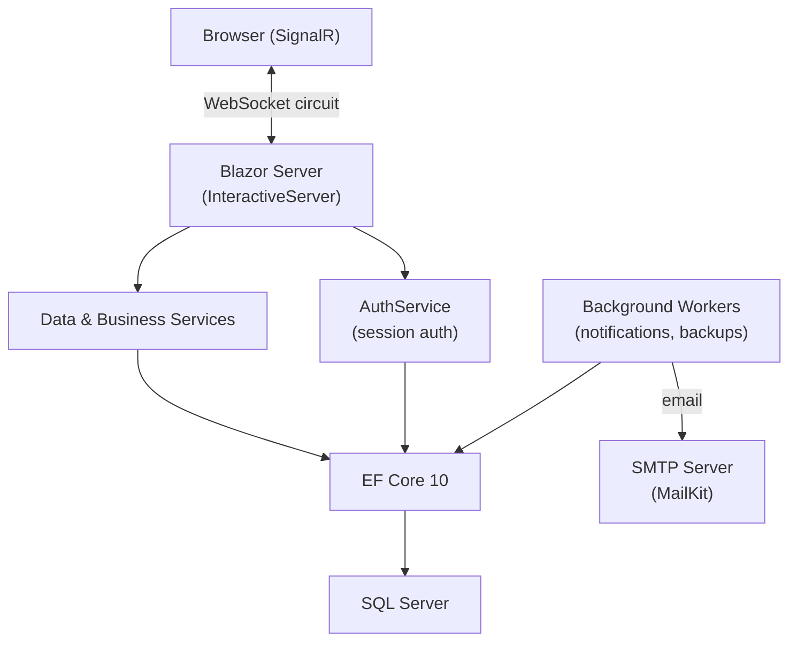
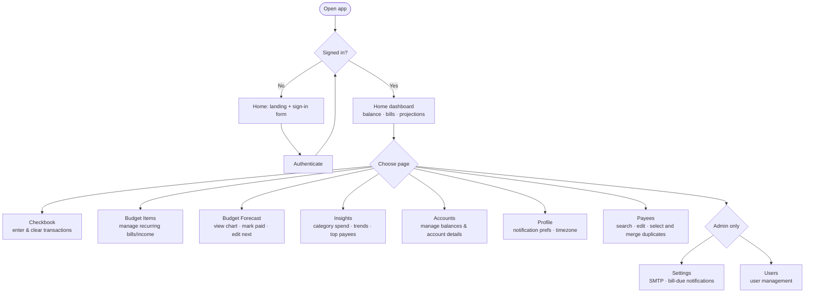

# SproutPenny Budget App

A personal budget and checkbook management application. Keeps a running transaction ledger, tracks recurring bills and income, forecasts your balance over time, and sends bill-due email reminders.

- **User Guide** → [docs/README.md](docs/README.md) (page-by-page walkthrough)
- **Backups** → [docs/backups.md](docs/backups.md) (backup/restore commands)
- **Globalization** → [GLOBALIZATION.md](GLOBALIZATION.md) (why culture is pinned to `en-US`)

---

## Technical overview



The app is a **Blazor Server** application — all rendering and logic runs on the server. The browser holds only a lightweight WebSocket circuit. There is no client-side WASM layer, and only a small authenticated JSON endpoint for home dashboard summary integrations.

---

## Architecture

| Layer | Description |
|---|---|
| **Components/Pages/** | Routable Blazor pages. Each page has a `.razor` markup file and a `.razor.cs` code-behind partial class. |
| **Components/Layout/** | `MainLayout` — navigation bar, startup diagnostics banner. |
| **Services/** | Scoped and singleton services for data access, auth, email, and background work. Injected via constructor or `@inject`. |
| **Data/** | EF Core `DbContext`. All database access goes through here. |
| **Models/Entities/** | EF Core entity classes mapped to `cf`-prefixed SQL tables. |
| **Models/ViewModels/** | UI-facing projection types returned by data services. |
| **Migrations/** | EF Core SQL Server migrations. Applied automatically on startup. |

---

## Build & Run

| Command | Purpose |
|---|---|
| `dotnet build` | Compile the project |
| `dotnet run` | Start the app |
| `dotnet watch` | Start with hot reload |
| `dotnet ef migrations add <Name>` | Create a new EF migration |
| `dotnet ef database update` | Apply pending migrations manually |
| `dotnet run -- backup --out ./backups` | Take a manual database backup |
| `dotnet run -- restore-smoketest --file ./backups/...` | Verify a backup file is readable |
| `dotnet run -- restore --file ./backups/...` | Restore a backup |

---

## User workflows



**Typical daily use:**
1. Open Home to check today's balance and upcoming bills
2. Open Checkbook to record any new transactions and clear settled ones
3. Open Insights to review this month's spending by category and payee
4. Optionally open Budget Forecast to see the shape of the next few weeks

**First-time setup:**
1. Accounts → create your accounts
2. Budget Items → add recurring bills and income
3. Checkbook → enter your opening balance transaction
4. Settings (admin) → configure SMTP if you want bill-due email reminders
5. Profile → opt in to notifications and set your timezone

**Payee cleanup:**
1. Open Payees to search, sort, and review active or deleted payees
2. Select two or more active payees with row checkboxes
3. Click Merge, choose the selected payee to keep, and preview the reassigned transaction and budget item totals
4. Confirm the merge to reassign activity to the kept payee and soft-delete the selected duplicates

---

## API surface

The app includes one authenticated JSON endpoint for home dashboard snapshot integrations.

### `POST /api/home-dashboard-summary`

Authenticates with an existing username/password using the app's shared auth validation behavior, then returns the same core summary values used on the Home page.

Request JSON:

```json
{
  "username": "your-username",
  "password": "your-password"
}
```

Response codes:

- `200 OK` for valid credentials
- `401 Unauthorized` for invalid credentials

Response JSON (`200 OK`):

```json
{
  "asOfDate": "2026-04-24T00:00:00",
  "todayBalance": 1234.56,
  "upcomingBillsTotal": 450.00,
  "safeToSpend": 980.12,
  "safeToSpendDate": "2026-05-03T00:00:00",
  "upcomingBills": [
    {
      "budgetId": 42,
      "name": "Electric",
      "payee": "Power Co",
      "dueDate": "2026-04-28T00:00:00",
      "amount": 125.00,
      "isPastDue": false
    }
  ],
  "categorySpend": [
    {
      "categoryName": "Groceries",
      "total": 320.50,
      "budgetedMonthly": 400.00,
      "isOnBudget": true
    }
  ]
}
```

For full endpoint details, see [docs/api/home-dashboard-summary.md](docs/api/home-dashboard-summary.md).

---

## Technology

| Technology | Version | Purpose |
|---|---|---|
| .NET / ASP.NET Core | 10.0 | Runtime, DI, middleware, hosting |
| Blazor Server | 10.0 | UI framework — interactive server rendering via SignalR |
| Entity Framework Core | 10.0.3 | ORM; migrations applied automatically on startup |
| Microsoft.Data.SqlClient | 6.1.4 | SQL Server driver |
| Radzen.Blazor | 9.0.6 | UI component library (forms, dialogs, grids) |
| MailKit | 4.15.1 | SMTP email dispatch |
| Bootstrap | 5.3.3 | Layout and utility CSS (CDN) |
| Font Awesome | 6.5.1 | Icons (CDN) |
| Chart.js | 4.4.1 | Budget forecast line chart (CDN) |
| Moment.js | 2.30.1 | Date formatting in Chart.js (CDN) |
| DataTables | — | Checkbook transaction grid with search/sort (CDN) |
| jQuery | 3.7.1 | Required by DataTables (CDN) |

---

## Domain concepts

| Term | Definition |
|---|---|
| **Account** | A financial account (checking, credit card, etc.) with a tracked balance and cleared balance. |
| **Transaction** | A ledger entry recording income or expenditure against an account. |
| **Budget item** | A recurring income or expense rule that drives the forecast and optionally triggers bill-due notifications. |
| **Budget forecast** | The projected running balance calculated from future budget items. |
| **Insights** | Simple expense reports for the signed-in user: selected-month category totals, recent category trends, and top payees. |
| **Category** | A user-owned classification tag applied to transactions and budget items. |
| **Payee** | A user-owned named entity representing who a payment is made to or received from. Active payees can be selected in bulk and merged into one kept payee while transactions and budget items are reassigned. |
| **Frequency** | A lookup value (Weekly, Bi-weekly, Monthly, etc.) controlling how often a budget item recurs. |
| **Safe to spend** | The lowest projected balance between today and the next paydate — used as a guardrail for discretionary spending. |
| **Cleared** | A flag on a transaction indicating it has settled in the bank. The cleared balance is the sum of cleared transactions only. |

---

## Checkbook receipt attachments

Transaction receipts are stored under the app-managed `wwwroot/uploads/receipts/{userId}/` directory. Transactions store only app-relative paths such as `uploads/receipts/3/<generated-file>.pdf`.

`ReceiptAttachments` in configuration controls upload behavior:

- `MaxFileSizeBytes` defaults to `5242880` (5 MB).
- Allowed extensions and content types are limited to PDF and common receipt image formats (`jpg`, `jpeg`, `png`, `gif`, `webp`, `bmp`, `tif`, `tiff`).
- Filenames are generated by the app; user-supplied filenames are never stored as paths.

Uploads are validated before becoming the transaction attachment. The `IAttachmentMalwareScanner` hook runs for every new or replacement receipt before the final file is committed; the default scanner accepts files without external scanning for local, development, and review environments. A scanner rejection prevents the transaction from referencing the upload and removes the partial file.

Replacing, removing, or deleting an attachment only deletes files that resolve under the configured receipt upload root. `ReceiptAttachmentCleanupWorker` runs the same guardrailed cleanup service daily and removes orphaned receipt files that are no longer referenced by `cfTransactions.AttachmentPath`, logging scanned, deleted, retained, skipped, and failed counts.

---

## File inventory

| Path | Description |
|---|---|
| `Program.cs` | App startup, DI registration, CLI commands (`backup`, `restore-smoketest`), startup diagnostics and migration runner |
| `ClintonFrankland.Blazor.csproj` | Version (`major.minor.patch.build`), NuGet references |
| `appsettings.json` | Connection string, `AppSettings`, `AuthSecurity`, receipt attachment limits, logging config |
| `appsettings.Development.json` | Dev credentials and overrides (not committed to production) |
| `Dockerfile` | Multi-stage Docker build |
| `GLOBALIZATION.md` | Explains why culture is pinned to en-US |
| `Components/App.razor` | HTML shell — loads CDN assets (Bootstrap, FA, Chart.js, DataTables) |
| `Components/_Imports.razor` | Global `@using` and `@inject` for all components |
| `Components/Routes.razor` | Router wired to `MainLayout` |
| `Components/Layout/MainLayout.razor(.cs)` | Navbar, layout shell, startup diagnostics banner |
| `Components/Pages/Home.razor(.cs)` | Dashboard (snapshot cards, category spending) / landing + sign-in for guests |
| `Components/Pages/Login.razor(.cs)` | Dedicated sign-in page |
| `Components/Pages/Checkbook.razor(.cs)` | Transaction ledger with running balance and budget panel |
| `Components/Pages/Budget.razor(.cs)` | Budget forecast chart and upcoming items list |
| `Components/Pages/Insights.razor(.cs)` | Authenticated spending reports by category, recent category trend, and top payees |
| `Components/Pages/BudgetItems.razor(.cs)` | CRUD for recurring budget items |
| `Components/Pages/Accounts.razor(.cs)` | Account list with balances and details |
| `Components/Pages/Payees.razor(.cs)` | Payee search, edit, transaction drill-in, active/deleted filtering, and selected-row duplicate merge workflow |
| `Components/Pages/Profile.razor(.cs)` | User preferences and notification settings |
| `Components/Pages/Settings.razor(.cs)` | Admin: SMTP config, bill-due notification settings, backup |
| `Components/Pages/Users.razor(.cs)` | Admin: user management |
| `Data/ClintonFranklandDbContext.cs` | EF Core `DbContext` — all `DbSet<T>` properties |
| `Models/Entities/` | EF Core entity classes (one per table) |
| `Models/ViewModels/` | UI projection types returned by data services |
| `Services/AuthService.cs` | Login, logout, lockout (5 attempts / 15-min window), session storage, audit logging |
| `Services/SiteInfoService.cs` | Reads `AppSettings` config block (site name, base URL, icon) |
| `Services/EmailSenderService.cs` | SMTP dispatch via MailKit |
| `Services/BillDueNotificationWorker.cs` | Hosted service — 15-min tick, sends bill-due emails per user timezone |
| `Services/AccountsDataService.cs` | Account CRUD and balance queries |
| `Services/CheckbookDataService.cs` | Transaction queries, payee/category lookups, monthly analytics |
| `Services/InsightsDataService.cs` | User-scoped expense reporting queries for the Insights page |
| `Services/ReceiptAttachmentStorageService.cs` | Checkbook receipt validation, generated filenames, scanner hook, safe delete, and orphan cleanup |
| `Services/IAttachmentMalwareScanner.cs` | Pluggable receipt attachment scan hook; default implementation is no-op |
| `Services/BudgetDataService.cs` | Budget CRUD and forecast projection logic |
| `Services/BudgetItemsDataService.cs` | Budget item management |
| `Services/PayeesDataService.cs` | Payee summaries, edit validation, merge preview, and user-scoped multi-source payee merge operations |
| `Services/DashboardDataService.cs` | Home snapshot: balance, upcoming bills, lowest projected balance, category spend |
| `Services/DatabaseBackupService.cs` | `BACKUP DATABASE … WITH COPY_ONLY, COMPRESSION` via ADO.NET |
| `Services/DatabaseBackupWorker.cs` | Hosted service — scheduled automated SQL backups |
| `Services/PasswordUtility.cs` | Salt generation and password hashing/verification |
| `Services/CurrencyPolicy.cs` | Decimal rounding helpers for currency values |
| `Services/StartupDiagnosticsState.cs` | Holds DB connectivity and pending-migration results for the admin banner |
| `Migrations/` | EF Core SQL Server migrations; applied automatically on startup |
| `wwwroot/css/app.css` | Global CSS overrides |
| `wwwroot/images/` | `sproutpenny.png`, `favicon.png` |
| `docs/` | Per-page user guides and test plans |

---

## Coding conventions

- Use file-scoped namespaces.
- Prefer `var` when the type is obvious.
- Use async EF Core APIs only — do not mix sync and async paths on the same resource.
- Never abbreviate variable or method names; keep names fully spelled out and human-readable.
- Keep component logic in `.razor.cs` code-behind files; keep `.razor` files markup-only.
- Use `IDbContextFactory<ClintonFranklandDbContext>` for per-operation contexts; never hold a `DbContext` across renders.
- The project version is a four-part field (`major.minor.patch.build`) in `ClintonFrankland.Blazor.csproj` — bump it in every task.

---

## Constraints

- Do not introduce another UI component library alongside Radzen.Blazor.
- Do not casually modify secrets or login credentials.
- Do not skip build and test verification before calling a task done.
- Do not hold `DbContext` instances across Blazor renders.
- Do not rename or remove `cf`-prefixed tables without a deliberate migration plan.

---

## Known pitfalls

- **Culture is pinned to `en-US`.** Currency formatting, `$` display, comma thousands separators, period decimals, and review/production parity depend on it. Do not remove the thread culture pin or `RequestLocalizationOptions` setup in `Program.cs`; see [GLOBALIZATION.md](GLOBALIZATION.md).
- **Radzen grids need explicit reload after mutations.** After inserting, updating, or deleting grid data, call the grid's `Reload()` method — the component does not refresh automatically.
- **SQL Server migration dialect.** EF Core migrations use SQL Server-specific syntax. Do not apply migrations generated for another provider.
- **Background worker timezone handling.** The bill-due notification worker operates in each user's stored timezone, not the server timezone. Changes to notification logic must account for this.
- **Four-part version field.** `ClintonFrankland.Blazor.csproj` uses `<Version>major.minor.patch.build</Version>`. The displayed app version is read directly from this field — increment it in every task.
- **Startup migrations.** EF migrations run automatically on startup. Always verify migration safety before deploying schema changes.

---

## SQL objects

All tables use the `cf` prefix.

| Table | Description |
|---|---|
| `cfUsers` | App users. Manually-assigned IDs, salt+hash passwords, `IsAdmin` flag, notification preferences (opt-in, timezone, delivery time). |
| `cfAccounts` | Financial accounts (checking, credit card, etc.). Tracks balance, cleared balance, credit limit, min payment, interest rate, due day. |
| `cfTransactions` | Ledger entries. Date, amount, payee, category, account, cleared flag, optional notes and attachment path. |
| `cfBudgets` | Recurring income/expense items. Frequency, next due date, end date, `IsBill`, `IsAutomatic`, `IsLate`, optional payee. |
| `cfCategories` | User-owned transaction and budget categories. |
| `cfPayees` | User-owned payees referenced by transactions and budget items. |
| `cfFrequencies` | Lookup: Weekly, Bi-weekly, Monthly, etc. |
| `cfAccountTypes` | Lookup: Checking, Savings, Credit Card, etc. |
| `cfAuthLoginAudit` | Login audit trail — username, IP, success/failure, reason, timestamp. |
| `cfSmtpSettings` | SMTP server configuration — host, port, TLS mode, sender identity, per-server credentials. |
| `cfBillDueNotificationSettings` | Server-wide gate for bill-due email notifications (enabled flag, due-soon window, past-due settings). |
| `cfNotificationSendLog` | Audit trail of sent notifications — user, budget, notice type, local date, status, error message. Prevents duplicate sends. |

---

## External dependencies

| Name | Version | Purpose |
|---|---|---|
| MailKit | 4.15.1 | SMTP email |
| Microsoft.Data.SqlClient | 6.1.4 | SQL Server wire protocol |
| Microsoft.EntityFrameworkCore.SqlServer | 10.0.3 | EF Core SQL Server provider |
| Microsoft.EntityFrameworkCore.Design | 10.0.3 | `dotnet ef` tooling support |
| Radzen.Blazor | 9.0.6 | Blazor UI component library |
| Bootstrap | 5.3.3 | CSS layout framework (CDN) |
| Font Awesome | 6.5.1 | Icon library (CDN) |
| Chart.js | 4.4.1 | Canvas charting (CDN) |
| Moment.js | 2.30.1 | Date labels for Chart.js (CDN) |
| DataTables | — | Table search/sort/pagination (CDN) |
| jQuery | 3.7.1 | DataTables dependency (CDN) |
