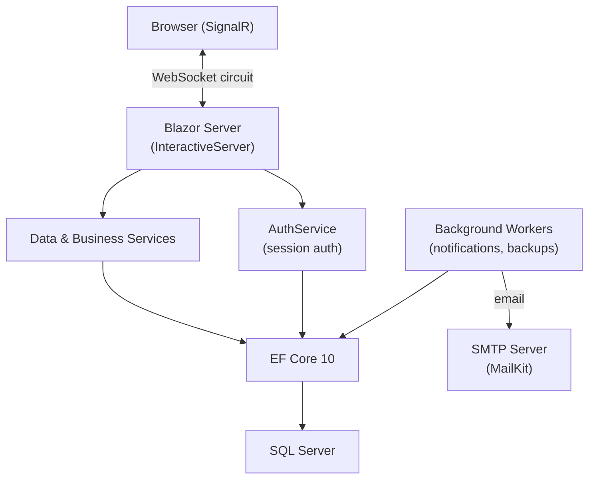
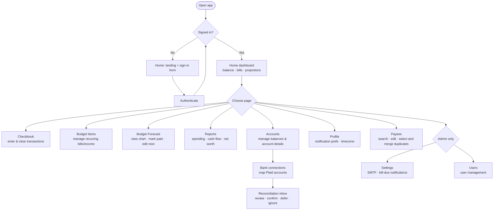

# SproutPenny Budget App

A personal budget and checkbook management application. Keeps a running transaction ledger, tracks recurring bills and income, forecasts your balance over time, and sends bill-due email reminders.

Transaction rules let each signed-in user define ordered, account-aware rules that automatically suggest category, payee, and notes during Checkbook create/edit. Users review or override every suggestion before saving and can preview exact field differences before transactionally applying rules to existing transactions. See [Transaction rules](docs/pages/transaction-rules.md).

Checkbook supports CSV backups and bank imports. **Export CSV** downloads every transaction the signed-in user can read. **Import CSV** accepts a CSV up to 5 MB, suggests mappings for date, amount, payee, and category, shows a validation preview of the first ten records, and imports only after Date and Amount are mapped and all rows validate. Imported entries preserve amount signs and start uncleared; omitted payees/categories use `Unknown` and `Uncategorized`.

- **User Guide** → [docs/README.md](docs/README.md) (page-by-page walkthrough)
- **Backups** → [docs/backups.md](docs/backups.md) (backup/restore commands)
- **Globalization** → [GLOBALIZATION.md](GLOBALIZATION.md) (why culture is pinned to `en-US`)
- **Authentik rollout** → [docs/authentik-rollout.md](docs/authentik-rollout.md) (access policy, provider setup, smoke checks, rollback)

---

## Technical overview



The app is a **Blazor Server** application — all rendering and logic runs on the server. The browser holds only a lightweight WebSocket circuit. There is no client-side WASM layer, and only a small authenticated JSON endpoint for home dashboard summary integrations.

Required browser interop assets use the application version in their URL so deployments do not leave existing browsers on stale JavaScript. Navigation-only interop is treated as cosmetic and must not terminate the Blazor circuit when a client temporarily has an older asset.

## Sharing foundation

SproutPenny keeps the legacy `UserId` ownership checks in place while adding a shared budget household foundation for future spouse/family sharing. Each active legacy user receives one default shared budget container during migration, plus an active owner membership. Accounts, transactions, categories, recurring budget items, category budget targets, and notification/reporting records now have a nullable `SharedBudgetId` so existing data remains readable and new data can be attached to the user's default shared budget.

Plaid Sandbox connections are opt-in server-side integrations. A Plaid Item access token is encrypted with ASP.NET Core Data Protection, and every discovered Plaid account must be explicitly mapped to a Budget account the user can manage. The **Reconciliation inbox** groups posted evidence into confident, probable/ambiguous, unmatched, pending, and changed/removed records. It never clears anything automatically: a user must explicitly confirm an authorized candidate, which atomically creates a one-to-one Plaid-to-ledger link and marks that existing transaction cleared. For an unmatched posted record, the user can instead add one cleared Checkbook entry after reviewing the mapped personal account, date, notes, payee, and category; payee and category are required, can be existing or newly entered Budget values, and Plaid never supplies a category automatically. Later Plaid changes or removals leave the ledger untouched and visible for manual review.

Membership supports `Owner`, `Admin`, `Editor`, and `Viewer` roles with active/removed status. Owner/Admin users can open **Sharing** to manage members, create email or username invites for Viewer, Editor, or Admin access, resend/revoke pending invites, update non-owner roles, and remove non-owner members. Members can leave budgets where they are not the current Owner; Owners transfer ownership to another active member before leaving. Invite records store only secure token hashes in `InviteTokenHash`; plaintext invite tokens are not persisted. Accept links require sign-in before they add membership, expire automatically, and can be revoked or resent by Owner/Admin users. Dashboard totals, Reports, bill-due notices, and Monday weekly upcoming-bills summaries are scoped to active readable memberships; Viewer members can receive read-only summaries, removed members receive nothing, and multi-budget email summaries identify each budget by name.

---

## Architecture

| Layer | Description |
|---|---|
| **Components/Pages/** | Routable Blazor pages. Each page has a `.razor` markup file and a `.razor.cs` code-behind partial class. |
| **Components/Layout/** | `MainLayout` — navigation bar, startup diagnostics banner. |
| **Services/** | Scoped and singleton services for data access, auth, email, and background work. Injected via constructor or `@inject`. |
| **Data/** | EF Core `DbContext`. All database access goes through here. |
| **Models/Entities/** | EF Core entity classes mapped to `cf`-prefixed SQL tables. |
| **Models/ViewModels/** | UI-facing projection types returned by data services. |
| **Migrations/** | EF Core SQL Server migrations. Applied automatically on startup. |

---

## Build & Run

| Command | Purpose |
|---|---|
| `dotnet build` | Compile the project |
| `dotnet run` | Start the app |
| `dotnet watch` | Start with hot reload |
| `dotnet ef migrations add <Name>` | Create a new EF migration |
| `dotnet ef database update` | Apply pending migrations manually |
| `dotnet run -- backup --out ./backups` | Take a manual database backup |
| `dotnet run -- restore-smoketest --file ./backups/...` | Verify a backup file is readable |
| `dotnet run -- restore --file ./backups/...` | Restore a backup |

### Local configuration

Committed settings files must not contain real SQL or fallback login secrets. `appsettings.Development.json` is intentionally safe to commit and leaves secret-bearing values empty. Use .NET user secrets for local development:

```bash
dotnet user-secrets set "ConnectionStrings:DefaultConnection" "<sql-server-connection-string>"
dotnet user-secrets set "AppSettings:LoginUser" "<fallback-login-user>"
dotnet user-secrets set "AppSettings:LoginPassword" "<fallback-login-password>"
```

For Docker or production-style runs, provide the same values as environment variables:

```bash
ConnectionStrings__DefaultConnection="<sql-server-connection-string>"
AppSettings__LoginUser="<fallback-login-user>"
AppSettings__LoginPassword="<fallback-login-password>"
```

`appsettings.Development.example.json` shows the expected shape without real credentials. For machine-local JSON overrides, use an ignored `appsettings.Development.local.json` file and load it manually only in private workflows.

### Confirm a non-production database

Before running migrations or tests that access SQL Server, verify the effective `ConnectionStrings:DefaultConnection` value privately. A connection string can contain credentials, so do not paste it into chat, tickets, logs, or screenshots.

- **Local development:** Check the value from the active local source, normally .NET user secrets. Confirm both `Server` and `Database`/`Initial Catalog` identify an approved local or development database.
- **Review/integration:** Check the value in the review environment's restricted configuration or secret store. It must name a dedicated review database, such as `budget_test` or a task-specific database, that is separate from both local development and production.
- **Stop if uncertain:** Do not run `dotnet ef database update`, start the application, or run database-backed tests if the server or database is blank, ambiguous, matches production, or cannot be independently confirmed.

Use placeholders in documentation and commands. Never copy a real connection string into the repository. Once the non-production target is confirmed, run migrations and tests from the intended local or review checkout only.

### Optional Authentik OIDC login

Authentik/OpenID Connect login is disabled by default. The production access policy is:

- Authentik controls entry to Budget App through the required `budget-users` group.
- Budget App controls application authorization, admin rights, and data ownership through active `cfUsers` rows.
- `cfUsers.IsAdmin` remains the source for Budget App admin permission. Authentik groups do not grant app admin rights.
- Local database login and the `AppSettings` fallback login remain the break-glass path until rollout is complete and disabling normal local password login has been explicitly tested and approved.

Enable Authentik only when all required settings are present:

```bash
Authentication__Authentik__Enabled=true
Authentication__Authentik__Authority="https://auth.example.com/application/o/budget-app/"
Authentication__Authentik__ClientId="<authentik-client-id>"
Authentication__Authentik__ClientSecret="<authentik-client-secret>"
Authentication__Authentik__AllowedGroups__0="budget-users"
```

The Authentik provider must use redirect URI `https://budget.clintandtara.com/signin-oidc` and logout redirect URI `https://budget.clintandtara.com/signout-callback-oidc` for production. The OIDC client must request the `openid`, `profile`, and `email` scopes, and it must emit a `groups`, `group`, `roles`, or standard role claim containing `budget-users`.

Budget App reads the stable `sub` claim and only grants access when that Authentik subject is already linked to an active `cfUsers` row. Group claims are captured when Authentik provides them; set `Authentication:Authentik:AllowedGroups` to require membership in one or more groups. Production should require `budget-users`; leave the list empty only for temporary local or review testing.

OIDC diagnostics log denied access for missing required groups, missing stable subject claims, unknown/unlinked subjects, remote failures, and linked-user success. Logs include provider names, group counts/names, Budget user IDs on success, and short subject fingerprints. They never log tokens, client secrets, or raw OIDC subjects.

For nginx or other reverse-proxy deployments:

- Forward `X-Forwarded-For`, `X-Forwarded-Proto`, and `X-Forwarded-Host`.
- Keep the app on the query response mode callback; this avoids Blazor/OIDC correlation failures caused by cross-site POST callbacks.
- Auth, correlation, and nonce cookies use `SameSite=Lax` with `SecurePolicy=SameAsRequest`, so the proxy must forward the original HTTPS scheme.
- Set `proxy_buffer_size 16k;` for the app location because OIDC callback responses can include large encrypted auth cookies.

Rollout checklist, production/review smoke checks, and emergency rollback steps live in [docs/authentik-rollout.md](docs/authentik-rollout.md).

---

## Identity ownership

Budget App keeps `cfUsers` as the durable application profile, permission, preference, and financial data-ownership record. A future Authentik/OIDC login can prove who signed in, but it must resolve to an active Budget user before the app grants access to Budget-owned data.

External identity mapping is stored directly on active `cfUsers` rows:

- `ExternalProvider` identifies the trusted identity provider, for example `authentik`.
- `ExternalSubject` stores the stable OIDC `sub` claim and is the canonical external identity key.
- `ExternalEmail` and `ExternalDisplayName` are provider metadata for display/audit help only.
- `LastExternalLoginUtc` records the last successful subject-based external login.

`ExternalProvider` + `ExternalSubject` has a filtered unique index for active users so one Authentik account cannot map to multiple Budget users. Email is intentionally not a permanent identity key; it may only be used later for guarded first-link or admin-confirmed matching before saving the provider subject.

Existing database-backed username/password login and the `AppSettings` fallback login remain supported during this phase.

When optional Authentik login is enabled, `/` and `/login` display **Sign in with Authentik** first and keep the local username/password form underneath as **Local fallback**. Return URLs are accepted only when they are rooted local paths; unsafe absolute or protocol-relative URLs are ignored for both login and logout redirects.

Authenticated Budget data uses `CurrentUserContext` to resolve the effective Budget `UserId` once per UI/data path. Database-backed and Authentik users resolve to their linked `cfUsers.UserId`, so accounts, budgets, transactions, categories, payees, insights, bill notices, and dashboard reads/writes remain isolated by owner. The only intentional exception is the legacy `AppSettings` fallback login: because that login has no `cfUsers` row, `CurrentUserContext` explicitly maps it to `AppSettings:DefaultUserId` until the fallback login is retired.

Admins manage Authentik links from **Settings > Users**. The grid shows provider, subject presence, external email/display name, and last external login without showing any credentials or tokens. Admins can link, relink, or unlink an Authentik identity with confirmation; regular users can view and manage their own Authentik link from **Profile**. The Profile flow starts Authentik with a link intent, returns to a confirmation screen that shows the Authentik display name/email next to the current Budget username, and saves only after explicit confirmation. The password utility is labeled as local-account-only for Authentik-linked users.

Manual first-user linking for Clinton's current Budget row:

1. Sign in with the local fallback login.
2. Open **Settings > Users**.
3. Link Clinton's active Budget user row to provider `authentik` and the stable Authentik `sub` claim.
4. Optionally save the Authentik email/display name for audit context.
5. Test **Sign in with Authentik** and verify `LastExternalLoginUtc` updates.

---

## User workflows



**Typical daily use:**
1. Open Home to check today's balance and upcoming bills
2. Open Checkbook to record any new transactions and clear settled ones
3. Open Reports to review this month's spending by category and payee
4. Optionally open Forecast to see the shape of the next few weeks

**First-time setup:**
1. Manage → Accounts → create your accounts and enter their current balances
2. Plan → Budget Items → add scheduled bills/income and category spending allowances
3. Checkbook → enter day-to-day transactions
4. Settings (admin) → configure SMTP if you want bill-due email reminders
5. Profile → opt in to notifications and set your timezone

**Payee cleanup:**
1. Open Payees to search, sort, and review active or deleted payees
2. Select two or more active payees with row checkboxes
3. Click Merge, choose the selected payee to keep, and preview the reassigned transaction and budget item totals
4. Confirm the merge to reassign activity to the kept payee and soft-delete the selected duplicates

---

## API surface

The app includes one authenticated JSON endpoint for home dashboard snapshot integrations.

### `POST /api/home-dashboard-summary`

Authenticates with an existing username/password using the app's shared auth validation behavior, then returns the same core summary values used on the Home page.

Request JSON:

```json
{
  "username": "your-username",
  "password": "your-password"
}
```

Response codes:

- `200 OK` for valid credentials
- `401 Unauthorized` for invalid credentials

Response JSON (`200 OK`):

```json
{
  "asOfDate": "2026-04-24T00:00:00",
  "todayBalance": 1234.56,
  "upcomingBillsTotal": 450.00,
  "safeToSpend": 980.12,
  "safeToSpendDate": "2026-05-03T00:00:00",
  "upcomingBills": [
    {
      "budgetId": 42,
      "name": "Electric",
      "payee": "Power Co",
      "dueDate": "2026-04-28T00:00:00",
      "amount": 125.00,
      "isPastDue": false
    }
  ],
  "categorySpend": [
    {
      "categoryName": "Groceries",
      "total": 320.50,
      "budgetedMonthly": 400.00,
      "isOnBudget": true
    }
  ]
}
```

For full endpoint details, see [docs/api/home-dashboard-summary.md](docs/api/home-dashboard-summary.md).

---

## Technology

| Technology | Version | Purpose |
|---|---|---|
| .NET / ASP.NET Core | 10.0 | Runtime, DI, middleware, hosting |
| Blazor Server | 10.0 | UI framework — interactive server rendering via SignalR |
| Entity Framework Core | 10.0.3 | ORM; migrations applied automatically on startup |
| Microsoft.Data.SqlClient | 6.1.4 | SQL Server driver |
| Radzen.Blazor | 9.0.6 | UI component library (forms, dialogs, grids) |
| MailKit | 4.15.1 | SMTP email dispatch |
| Bootstrap | 5.3.3 | Layout and utility CSS (CDN) |
| Font Awesome | 6.5.1 | Icons (CDN) |
| Chart.js | 4.4.1 | Budget forecast line chart (CDN) |
| Moment.js | 2.30.1 | Date formatting in Chart.js (CDN) |
| DataTables | — | Checkbook transaction grid with search/sort (CDN) |
| jQuery | 3.7.1 | Required by DataTables (CDN) |

---

## Domain concepts

| Term | Definition |
|---|---|
| **Account** | A financial account (checking, credit card, etc.) with a tracked balance and cleared balance. |
| **Transaction** | A ledger entry recording income or expenditure against an account. |
| **Budget item** | A recurring plan that is either a scheduled transaction or a spending allowance. Scheduled items drive dated cash flow and can trigger bill notices; allowances are consumed by actual category spending and reserve only the unspent amount in Forecast. |
| **Budget forecast** | The projected running balance calculated from future budget items. |
| **Reports** | One read-only reporting destination with Overview, Spending, Cash Flow, and Net Worth sections. Spending includes a selected-month variance snapshot reconstructed from expense transactions and spending allowances, with historical category targets used only when no allowance plan exists. Signed variance is budgeted minus actual; actual-only categories are identified as Unbudgeted. The former Insights route redirects to Spending. See [Reports](docs/pages/reports.md). |
| **Category** | A user-owned classification tag applied to transactions and budget items. |
| **Payee** | A user-owned named entity representing who a payment is made to or received from. Active payees can be selected in bulk and merged into one kept payee while transactions and budget items are reassigned. |
| **Frequency** | A lookup value (Weekly, Bi-weekly, Monthly, etc.) controlling how often a budget item recurs. |
| **Safe to spend** | The lowest projected balance between today and the next paydate — used as a guardrail for discretionary spending. |
| **Cleared** | A flag on a transaction indicating it has settled in the bank. The cleared balance is the sum of cleared transactions only. |
| **Plaid reconciliation recommendation** | A read-only comparison of posted Plaid evidence and exclusively owned ledger transactions. It requires sign-correct amount and bounded-date evidence, then uses normalized payee, check/reference, pending-to-posted, or an existing `plaid:{transactionId}` notes marker as explainable supporting evidence. Pending, removed, shared, transfer/cash/refund/split-like, duplicate, and non-unique cases cannot produce a clear recommendation. Unmatched posted evidence can be manually added as one sign-correct cleared entry only after required Budget payee/category review. |

### Money and date policy

All persisted currency values are rounded through `Services/CurrencyPolicy.cs` to two decimal places with `MidpointRounding.AwayFromZero` before save and before derived money totals are displayed. Transaction entry stores a signed amount from the expense/income selector, but user-entered amount fields stay non-negative and must fit the mapped SQL decimal precision after rounding.

Transaction dates are stored as SQL `date` values through `DateOnly`. Budget next due dates are required, and an optional recurring end date cannot be before the next due date.

---

## Checkbook receipt attachments

Transaction receipts are stored under the app-managed `wwwroot/uploads/receipts/{userId}/` directory. Transactions store only app-relative paths such as `uploads/receipts/3/<generated-file>.pdf`.

`ReceiptAttachments` in configuration controls upload behavior:

- `MaxFileSizeBytes` defaults to `5242880` (5 MB).
- Allowed extensions and content types are limited to PDF and common receipt image formats (`jpg`, `jpeg`, `png`, `gif`, `webp`, `bmp`, `tif`, `tiff`).
- Filenames are generated by the app; user-supplied filenames are never stored as paths.

Uploads are validated before becoming the transaction attachment. The `IAttachmentMalwareScanner` hook runs for every new or replacement receipt before the final file is committed; the default scanner accepts files without external scanning for local, development, and review environments. A scanner rejection prevents the transaction from referencing the upload and removes the partial file.

Replacing, removing, or deleting an attachment only deletes files that resolve under the configured receipt upload root. `ReceiptAttachmentCleanupWorker` runs the same guardrailed cleanup service daily and removes orphaned receipt files that are no longer referenced by `cfTransactions.AttachmentPath`, logging scanned, deleted, retained, skipped, and failed counts.

---

## File inventory

| Path | Description |
|---|---|
| `Program.cs` | App startup, DI registration, CLI commands (`backup`, `restore-smoketest`), startup diagnostics and migration runner |
| `ClintonFrankland.Blazor.csproj` | Version (`major.minor.patch.build`), NuGet references |
| `appsettings.json` | Connection string, `AppSettings`, `AuthSecurity`, receipt attachment limits, logging config |
| `appsettings.Development.json` | Dev credentials and overrides (not committed to production) |
| `Dockerfile` | Multi-stage Docker build |
| `GLOBALIZATION.md` | Explains why culture is pinned to en-US |
| `Components/App.razor` | HTML shell — loads CDN assets (Bootstrap, FA, Chart.js, DataTables) |
| `Components/_Imports.razor` | Global `@using` and `@inject` for all components |
| `Components/Routes.razor` | Router wired to `MainLayout` |
| `Components/Layout/MainLayout.razor(.cs)` | Navbar, layout shell, startup diagnostics banner |
| `Components/Pages/Home.razor(.cs)` | Dashboard (snapshot cards, category spending) / landing + sign-in for guests |
| `Components/Pages/Login.razor(.cs)` | Dedicated sign-in page |
| `Components/Pages/Checkbook.razor(.cs)` | Transaction ledger with running balance and budget panel |
| `Components/Pages/Budget.razor(.cs)` | Budget forecast chart and upcoming items list |
| `Components/Pages/Insights.razor(.cs)` | Legacy route redirect to the Spending section of Reports |
| `Components/Pages/PlaidReconciliation.razor(.cs)` | Accessible review-first Plaid reconciliation inbox with explicit confirm, add-to-Checkbook, defer, ignore, stale-state, and changed-source handling. |
| `Components/Pages/Reports.razor(.cs)` | Authenticated reporting dashboard with four focused sections |
| `Components/Pages/BudgetItems.razor(.cs)` | CRUD for recurring budget items plus near-term record/skip preview calendar |
| `Components/Pages/Accounts.razor(.cs)` | Account list with balances and details |
| `Components/Pages/Payees.razor(.cs)` | Payee search, edit, transaction drill-in, active/deleted filtering, and selected-row duplicate merge workflow |
| `Components/Pages/Profile.razor(.cs)` | User preferences and notification settings |
| `Components/Pages/Settings.razor(.cs)` | Admin: SMTP config, bill-due notification settings, backup |
| `Components/Pages/Users.razor(.cs)` | Admin: user management |
| `Components/Pages/Sharing.razor(.cs)` | Shared-budget member, owner transfer, leave, and invite management |
| `Components/Pages/AcceptShareInvite.razor(.cs)` | Authenticated shared-budget invite acceptance |
| `Data/ClintonFranklandDbContext.cs` | EF Core `DbContext` — all `DbSet<T>` properties |
| `Models/Entities/` | EF Core entity classes (one per table) |
| `Models/ViewModels/` | UI projection types returned by data services |
| `Services/AuthService.cs` | Login, logout, lockout (5 attempts / 15-min window), session storage, audit logging |
| `Services/CurrentUserContext.cs` | Central effective Budget user resolver for authenticated data isolation; contains the explicit AppSettings fallback exception |
| `Services/BudgetInviteService.cs` | Shared-budget invite create, revoke, resend, preview, and accept workflow |
| `Services/AuthentikOidcDiagnostics.cs` | Safe OIDC decision logging for missing groups, missing subjects, unlinked users, remote failures, and linked-user success |
| `Services/ExternalIdentityLinkService.cs` | Subject-first Authentik/OIDC identity mapping for active Budget users |
| `Services/SiteInfoService.cs` | Reads `AppSettings` config block (site name, base URL, icon) |
| `Services/EmailSenderService.cs` | SMTP dispatch via MailKit |
| `Services/BillDueNotificationWorker.cs` | Hosted service — 15-min tick, sends bill-due emails per user timezone |
| `Services/AccountsDataService.cs` | Account CRUD and balance queries |
| `Services/PlaidClient.cs` | Server-only Plaid Sandbox REST client and DTOs; never returns access tokens to browser code |
| `Services/PlaidConnectionService.cs` | Encrypted Item persistence, discovery, explicit account mapping, update, and disconnect authorization |
| `Services/PlaidReconciliationService.cs` | Deterministic staged-Plaid-to-ledger matching plus authorization-scoped, source-fingerprint-checked explicit confirmation and atomic add-to-Checkbook actions. |
| `Services/CheckbookDataService.cs` | Transaction queries, payee/category lookups, monthly analytics |
| `Services/BudgetScheduleService.cs` | Forecast and recurring occurrence handling, including preview record/skip actions |
| `Services/InsightsDataService.cs` | User-scoped expense reporting queries used by the Spending reports |
| `Services/ReportsDataService.cs` | Readable-budget-scoped plan, trend, cashflow, and net-worth calculations |
| `Services/ReceiptAttachmentStorageService.cs` | Checkbook receipt validation, generated filenames, scanner hook, safe delete, and orphan cleanup |
| `Services/IAttachmentMalwareScanner.cs` | Pluggable receipt attachment scan hook; default implementation is no-op |
| `Services/BudgetDataService.cs` | Budget CRUD and forecast projection logic |
| `Services/BudgetItemsDataService.cs` | Unified scheduled-transaction and spending-allowance item management |
| `Services/BudgetAllowanceService.cs` | Recurrence-window allowance progress from posted category expenses |
| `Services/PayeesDataService.cs` | Payee summaries, edit validation, merge preview, and user-scoped multi-source payee merge operations |
| `Services/DashboardDataService.cs` | Home snapshot: balance, upcoming bills, lowest projected balance, and current-period allowance progress |
| `Services/DatabaseBackupService.cs` | `BACKUP DATABASE … WITH COPY_ONLY, COMPRESSION` via ADO.NET |
| `Services/DatabaseBackupWorker.cs` | Hosted service — scheduled automated SQL backups |
| `Services/PasswordUtility.cs` | Salt generation and password hashing/verification |
| `Services/CurrencyPolicy.cs` | Currency rounding, SQL precision validation, and shared amount validation messages |
| `Services/StartupDiagnosticsState.cs` | Holds DB connectivity and pending-migration results for the admin banner |
| `Migrations/` | EF Core SQL Server migrations; applied automatically on startup |
| `wwwroot/css/app.css` | Global CSS overrides |
| `wwwroot/images/` | `sproutpenny.png`, `favicon.png` |
| `docs/` | Per-page user guides and test plans |

---

## Coding conventions

- Use file-scoped namespaces.
- Prefer `var` when the type is obvious.
- Use async EF Core APIs only — do not mix sync and async paths on the same resource.
- Never abbreviate variable or method names; keep names fully spelled out and human-readable.
- Keep component logic in `.razor.cs` code-behind files; keep `.razor` files markup-only.
- Use `IDbContextFactory<ClintonFranklandDbContext>` for per-operation contexts; never hold a `DbContext` across renders.
- Use `CurrencyPolicy` for all currency rounding, SQL decimal fit checks, and user-entered money validation messages.
- The project version is a Semantic Version (`major.minor.patch`) in `ClintonFrankland.Blazor.csproj` — bump it in every task.

---

## Constraints

- Do not introduce another UI component library alongside Radzen.Blazor.
- Do not casually modify secrets or login credentials.
- Do not skip build and test verification before calling a task done.
- Do not hold `DbContext` instances across Blazor renders.
- Do not rename or remove `cf`-prefixed tables without a deliberate migration plan.

---

## Known pitfalls

- **Culture is pinned to `en-US`.** Currency formatting, `$` display, comma thousands separators, period decimals, and review/production parity depend on it. Do not remove the thread culture pin or `RequestLocalizationOptions` setup in `Program.cs`; see [GLOBALIZATION.md](GLOBALIZATION.md).
- **Currency is rounded before persistence.** Use `CurrencyPolicy.Round` or its validation helpers instead of direct `Math.Round` for money; transaction amounts are limited by `decimal(9, 2)` and budget/account values by `decimal(18, 2)`.
- **Radzen grids need explicit reload after mutations.** After inserting, updating, or deleting grid data, call the grid's `Reload()` method — the component does not refresh automatically.
- **SQL Server migration dialect.** EF Core migrations use SQL Server-specific syntax. Do not apply migrations generated for another provider.
- **Background worker timezone handling.** The bill-due notification worker operates in each user's stored timezone, not the server timezone. Changes to notification logic must account for this.
- **Semantic project version.** `ClintonFrankland.Blazor.csproj` uses `<Version>major.minor.patch</Version>`. The displayed app version is read directly from this field — increment the appropriate semantic component in every task.
- **Startup migrations.** EF migrations run automatically on startup. Always verify migration safety before deploying schema changes.

---

## SQL objects

All tables use the `cf` prefix.

| Table | Description |
|---|---|
| `cfUsers` | App users. Manually-assigned IDs, salt+hash passwords, `IsAdmin` flag, daily bill-due and weekly upcoming-bills notification preferences, and optional Authentik/OIDC provider+subject mapping. |
| `cfAccounts` | Financial accounts (checking, credit card, etc.). Tracks balance, cleared balance, credit limit, min payment, interest rate, due day. |
| `cfPlaidItems` | Per-user Plaid Item metadata and Data Protection-encrypted access tokens. |
| `cfPlaidAccountMappings` | Case-sensitive Plaid account IDs explicitly mapped to managed Budget accounts. |
| `cfPlaidTransactionStaging` | Idempotent Plaid sync evidence, review state, one-to-one optional ledger link, and source snapshot. Plaid outflows are positive while Budget expenses remain negative; confirmation or required-field manual add—not sync—creates/clears the linked ledger entry. |
| `cfTransactions` | Ledger entries. Date, amount, payee, category, account, cleared flag, optional notes and attachment path. |
| `cfBudgets` | Recurring income/expense items. Frequency, next due date, end date, `IsBill`, `IsAutomatic`, `IsLate`, optional payee. |
| `cfCategories` | User-owned transaction and budget categories. |
| `cfPayees` | User-owned payees referenced by transactions and scheduled budget items. |
| `cfCategoryBudgetTargets` | Legacy monthly category targets retained for historical reports; active planning is migrated to allowance Budget Items. |
| `cfFrequencies` | Lookup: Weekly, Bi-weekly, Monthly, etc. |
| `cfAccountTypes` | Lookup: Checking, Savings, Credit Card, etc. |
| `cfAuthLoginAudit` | Login audit trail — username, IP, success/failure, reason, timestamp. |
| `cfSmtpSettings` | SMTP server configuration — host, port, TLS mode, sender identity, per-server credentials. |
| `cfBillDueNotificationSettings` | Server-wide gate for bill-due email notifications (enabled flag, due-soon window, past-due settings). |
| `cfNotificationSendLog` | Audit trail of sent notifications — user, budget, notice type, local date, status, error message. Prevents duplicate daily notices and weekly digest sends. |

---

## External dependencies

| Name | Version | Purpose |
|---|---|---|
| MailKit | 4.15.1 | SMTP email |
| Microsoft.Data.SqlClient | 6.1.4 | SQL Server wire protocol |
| Microsoft.EntityFrameworkCore.SqlServer | 10.0.3 | EF Core SQL Server provider |
| Microsoft.EntityFrameworkCore.Design | 10.0.3 | `dotnet ef` tooling support |
| Radzen.Blazor | 9.0.6 | Blazor UI component library |
| Bootstrap | 5.3.3 | CSS layout framework (CDN) |
| Font Awesome | 6.5.1 | Icon library (CDN) |
| Chart.js | 4.4.1 | Canvas charting (CDN) |
| Moment.js | 2.30.1 | Date labels for Chart.js (CDN) |
| DataTables | — | Table search/sort/pagination (CDN) |
| jQuery | 3.7.1 | DataTables dependency (CDN) |

Local application CSS and JavaScript URLs include the application version. This prevents a deployment from combining new markup or interop calls with stale browser-cached assets. Navigation dropdown labels also use Bootstrap display utilities so their title-and-description layout remains readable even before refreshed application CSS is available.

# Budget item actions

Manageable recurring budget rows use the same four actions throughout Checkbook, Budget Forecast, and Budget Items: Record to Checkbook, Skip, Edit, and Edit Next. Skip is occurrence-aware: selecting a projected row advances through that row's due date without creating a Checkbook transaction, and a repeated or stale request for that occurrence does nothing. The page's most common action uses the original small Radzen icon button and original icon immediately beside a fixed 1.5rem-wide icon-only More actions trigger; both expose descriptive accessible names and tooltips. The fixed inline size overrides the Radzen theme loaded later in the document, so the trigger stays narrow on phones. The trigger uses explicit application state so tapping it reliably opens the overflow menu, which retains the app's original icon and a visible label for each remaining command. The menu is rendered in the browser's top-layer popover and positioned against its trigger in viewport coordinates. It automatically opens above or below according to available space, but remains outside the grid's scroll geometry so opening it never adds a list scrollbar or clips it behind another row. The compact pair uses a 70px list column so it remains adjacent and visible on narrow screens, whether list actions are placed on the left or right. The layout loads the shared-budget switcher in an isolated dependency-injection scope because layout and page first-render work can overlap in a Blazor circuit; this prevents refresh-time EF operations from sharing one `DbContext`.
